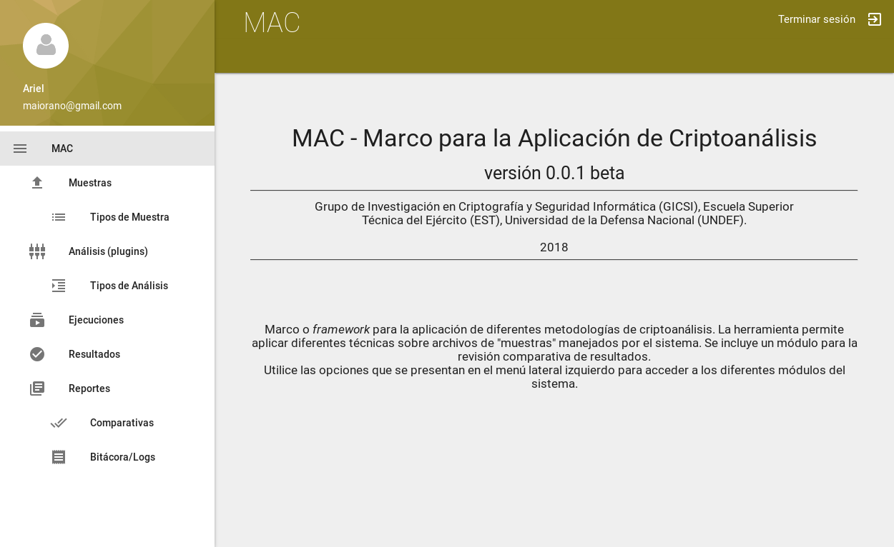
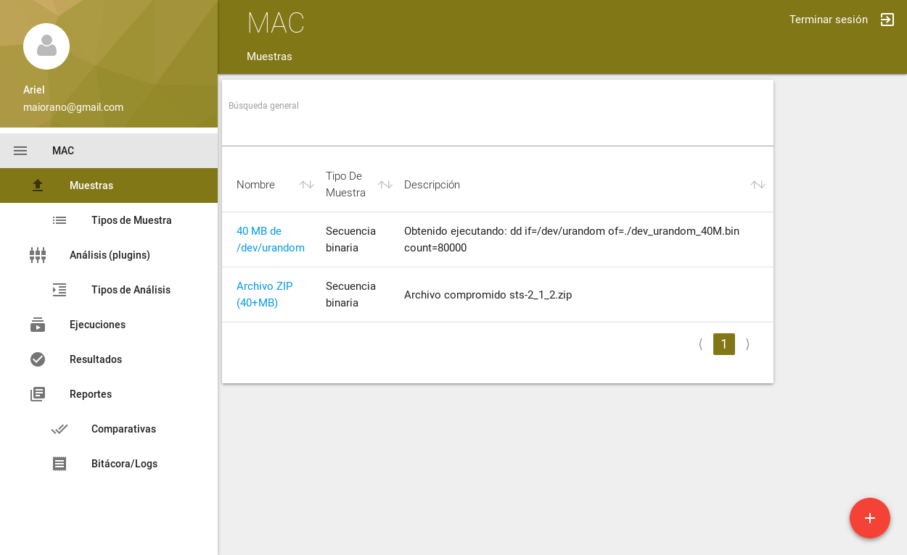
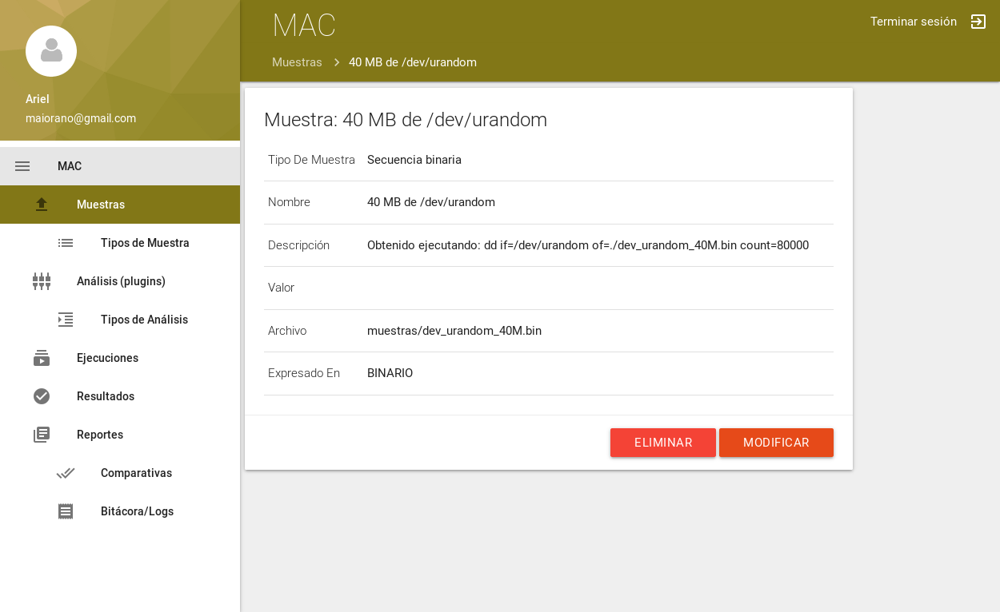
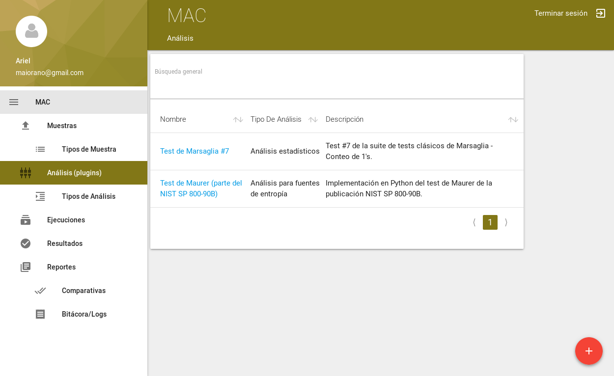
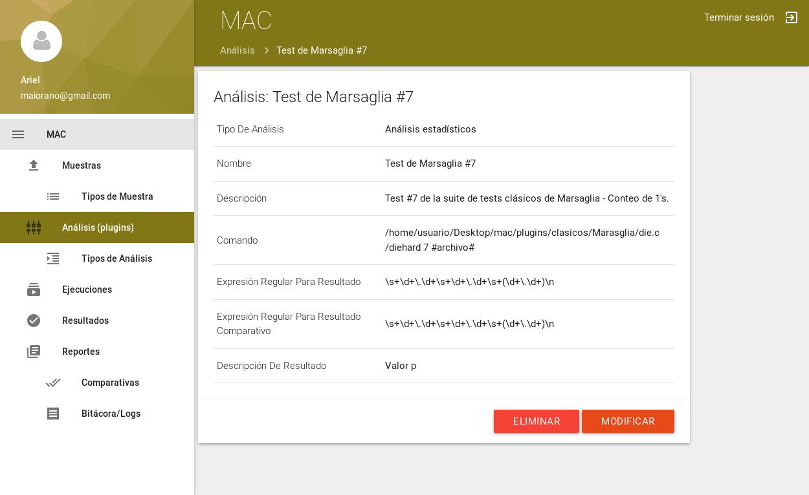
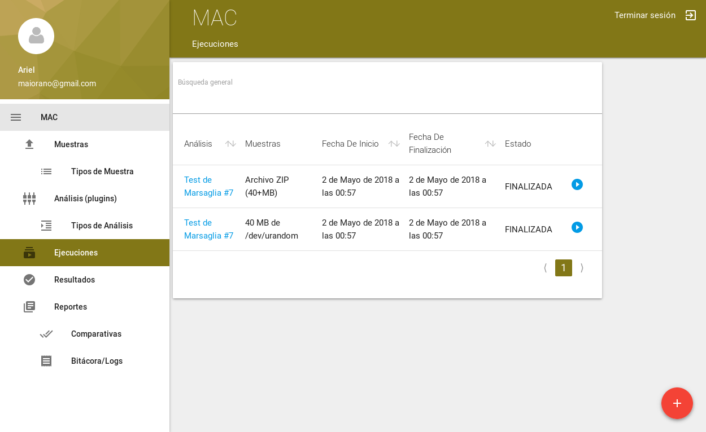
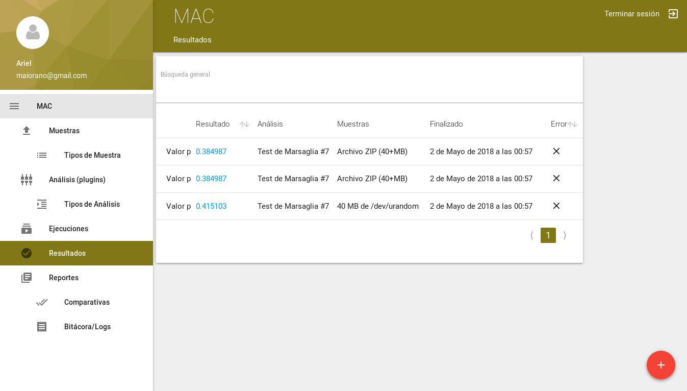

# PROYECTO EN DESARROLLO


## MAC - Marco para la Aplicación de Criptoanálisis

##### Versión 0.0.1 beta

Marco o *framework* para la aplicación de diferentes metodologías de criptoanálisis. La herramienta permite aplicar diferentes técnicas sobre archivos de "muestras" manejados por el sistema. Se incluye un módulo para la revisión comparativa de resultados.

Se trata de una aplicación Web, desarrollada en lenguaje Python, utilizando el framework Web Django. Los "análisis", que se integran a a la aplicación configurándose como plugins, podrían deasarrollarse en cualquier lenguaje ya que son ejecutados como programas externos. Los ejemplos de plugins incluidos se encuentran programados en Python y C.

###### Grupo de Investigación en Criptografía y Seguridad Informática (GICSI), Escuela Superior Técnica del Ejército (EST), Universidad de la Defensa Nacional (UNDEF).


#### Instalación


```

sudo apt-get install python3
sudo apt-get install python3-virtualenv


mkdir mac.git
cd mac.git
git clone https://github.com/gicsi/mac.git

cd mac
virtualenv venv


source venv/bin/activate
pip install -r requirements.txt

cd django/mac
python manage.py makemigrations
python manage.py migrate
python manage.py createsuperuser
...

```


#### Prueba de la aplicación Web

Arrancar servidor de desarrollo embebido django (por defecto quedará disponible en http://127.0.0.1:8000/):

```

source venv/bin/activate # si no estuviese ya activado
cd django
cd mac

celery -A mac worker -l info &

python manage.py runserver

```


#### Capturas de pantalla

Se presentan algunas capturas de pantalla o *screenshots* de diferentes módulos de la interfaz Web de la aplicación.


###### Ingreso

Página de control de acceso y página principal.





###### Manejo de muestras

Muestras de ejemplo cargadas.






###### Manejo de plugins de análisis

Ejemplos de análisis.






###### Ejecución y resultados

Ejemplos de ejecuciones de análisis y resultados.






#### Estructura de directorios del sistema

```

├── django
│   └── mac
│       ├── mac
│       │   ├── settings.py
│       │   ├── urls.py
│       │   └── wsgi.py
│       ├── macwebapp
│       │   ├── admin.py
│       │   ├── apps.py
│       │   ├── models.py
│       │   ├── tests.py
│       │   ├── urls.py
│       │   └── views.py
│       ├── manage.py
│       ├── media
│       │   └── muestras
│       └── templates
│           └── ...
├── plugins
│   ├── clasicos
│   │   ├── Marasglia
│   │   │   ├── die.c
│   │   │   │   └── ...
│   │   │   └── README.md
│   │   ├── NIST
│   │   │   ├── README.md
│   │   │   ├── SP_800-22
│   │   │   │   └── sts-2.1.2
│   │   │   │           └── ...
│   │   │   └── SP_800-90B
│   │   │       ├── maurer.py
│   │   │       └── util90b.py
│   │   ├── README.md
│   │   └ ...
│   ├ ...
│   └── README.md
├── README.md
└ ...

```

#### Acerca del proyecto

Proyecto académico del Grupo de Investigación en Criptografía y Seguridad Informática (GICSI), de la Escuela Superior Técnica del Ejército (EST), de la Universidad de la Defensa Nacional (UNDEF); enmarcado en el trabajo realizado por los miembros doctorandos en el área "Redes y comunicaciones", sub-área "Criptografía", del Doctorado en Ciencias Informáticas de la Universidad Nacional de La Plata (UNLP); a la vez parte del proyecto SAESCI aprobado en el Programa de Acreditación y Financiamiento de Proyectos de Investigación (UNDEFI), de la Universidad de la Defensa Nacional (UNDEF).

#### Autores

Grupo de Investigación en Criptografía y Seguridad Informática (GICSI), de la Escuela Superior Técnica del Ejército (EST), de la Universidad de la Defensa Nacional (UNDEF).


#### Contribuyentes

Becarios realizando pasantía en el laboratorio que contribuyeron con aportes y colaboraciones en el desarrollo de plugins de análisis:


#### Agradecimientos


#### Licencia

MAC - Marco para la Aplicación de Criptoanálisis
Copyright (C) GICSI 2018

This program is free software: you can redistribute it and/or modify
it under the terms of the GNU General Public License as published by
the Free Software Foundation, either version 3 of the License, or
(at your option) any later version.

This program is distributed in the hope that it will be useful,
but WITHOUT ANY WARRANTY; without even the implied warranty of
MERCHANTABILITY or FITNESS FOR A PARTICULAR PURPOSE.  See the
GNU General Public License for more details.

You should have received a copy of the GNU General Public License
along with this program.  If not, see <http://www.gnu.org/licenses/>.

